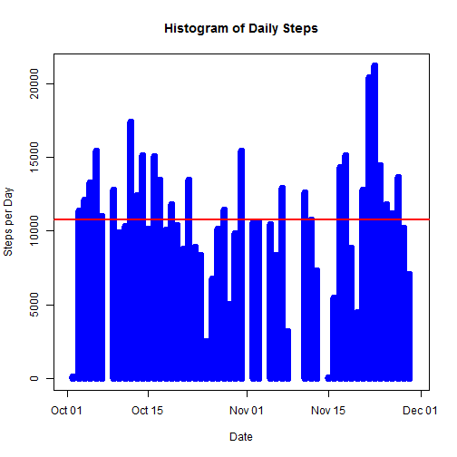
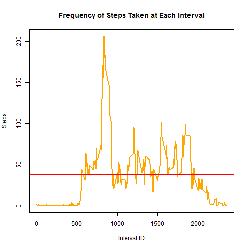
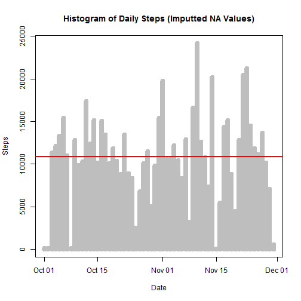

**SECTION 1: Calculating and plotting the mean of the total number of steps per day**

*Step 1A: Load the data from the source file*


```r
# Read activity.csv file into "activity" variable
activity <- read.csv(file="C:/Git_vss/RepResearch/activity.csv")

# Convert date field from factor to date
activity$date <- as.Date(activity$date)
```

*Step 1B: Process data to make it ready for plotting and analysis*


```r
# Load reshape2 library to get melt & dcast functions
library(reshape2)

# Melt data frame to prep for casting by date -- by setting the id variable to date and the measure variable to steps, we get a table with multiple values for steps taken within each day
actMeltDate <- melt(activity, id.vars="date", measure.vars="steps", na.rm=FALSE)

# Cast data frame to see steps per day -- this sums the steps by date to give us a table of 3 columns x 61 rows
actCastDate <- dcast(actMeltDate, date ~ variable, sum)
```

*Step 1C: Plot histogram of data*


```r
# Plot histogram with frequency of steps by day and add a red line showing the mean value
plot(actCastDate$date, actCastDate$steps, type="h", main="Histogram of Daily Steps", xlab="Date", ylab="Steps per Day", col="blue", lwd=8)
abline(h=mean(actCastDate$steps, na.rm=TRUE), col="red", lwd=2)
```

 

*Step 1D: Calculate mean and median of steps by day*


```r
# Calculate mean and median of daily steps
paste("Mean Steps per Day =", mean(actCastDate$steps, na.rm=TRUE))
```

```
## [1] "Mean Steps per Day = 10766.1886792453"
```

```r
paste("Median Steps per Day =", median(actCastDate$steps, na.rm=TRUE))
```

```
## [1] "Median Steps per Day = 10765"
```


**SECTION 2: Calculating and plotting the average daily activity pattern by interval**

*Step 2A: Reprocess data to calculate by interval instead of day*


```r
# Re-melt data frame to prep for casting by interval, including removing NA values so we can take the mean a little later
actMeltInt <- melt(activity, id.vars="interval", measure.vars="steps", na.rm=TRUE)

# Cast data frame to see mean steps per interval
actCastInt <- dcast(actMeltInt, interval ~ variable, mean)
```

*Step 2B: Create a time series plot of average steps by interval*


```r
# Plot line chart with average frequency of steps by interval and add line with mean
plot(actCastInt$interval, actCastInt$steps, type="l", main="Frequency of Steps Taken at Each Interval", xlab="Interval ID", ylab="Steps", col="orange", lwd=2)
abline(h=mean(actCastInt$steps, na.rm=TRUE), col="red", lwd=2)
```

 

```r
# The plot shows the peak at somewhere in the 800-900 interval range so let's find out exactly which interval has the max value and what that maximum value is
# Output interval that has max value along with the max value
paste("Interval with max value =", actCastInt$interval[which(actCastInt$steps == max(actCastInt$steps))])
```

```
## [1] "Interval with max value = 835"
```

```r
paste("Maximum interval mean steps =", max(actCastInt$steps))
```

```
## [1] "Maximum interval mean steps = 206.169811320755"
```


**SECTION 3: Imputing missing values to replace NAs in data set and compare results**

*Step 3A: Calculate total number of missing values in dataset*


```r
# Calculate number of rows in activity data set with NA rows
sum(is.na(activity$steps))
```

```
## [1] 2304
```

*Step 3B: Document strategy of dealing with missing value*

Since there are a considerable number of missing/NA values (2,304), I will replace NAs with the mean for the particular interval number.  For example: if the average number of steps taken during interval x is y, I will replace each NA with the corresponding y value for that row).  I will then recalculate the steps per day to see how much it differs from the original result (with NAs included), if at all.  

*Step 3C: Create new data set with imputed NA values as stated in strategy*


```r
# Data frame with mean steps per interval - just renaming to be more descriptive
stepsPerInt <- actCastInt

# Create data frame that we will remove NAs from
actNoNA <- activity

# Merge activity data set with stepsPerInt data set
actMerge = merge(actNoNA, stepsPerInt, by="interval", suffixes=c(".act", ".spi"))

# Get list of indexes where steps value = NA
naIndex = which(is.na(actNoNA$steps))

# Replace NA values with value from steps.spi
actNoNA[naIndex,"steps"] = actMerge[naIndex,"steps.spi"]
```

*Step 3D: Plot histogram and calculate mean and median of total steps/day with new (no NA) data set and compare with original.*


```r
# Melt new data frame to prep for casting by date
actMeltDateNoNA <- melt(actNoNA, id.vars="date", measure.vars="steps", na.rm=FALSE)

# Cast data frame to see steps per day
actCastDateNoNA <- dcast(actMeltDateNoNA, date ~ variable, sum)

# Plot histogram with frequency of steps by day
plot(actCastDateNoNA$date, actCastDateNoNA$steps, type="h", main="Histogram of Daily Steps (Imputted NA Values)", xlab="Date", ylab="Steps", col="gray", lwd=8)
abline(h=mean(actCastDateNoNA$steps), col="red", lwd=2)
```

 

```r
# Calculate mean and median of daily steps
paste("Mean daily steps =", mean(actCastDateNoNA$steps, na.rm=TRUE))
```

```
## [1] "Mean daily steps = 10889.7992576554"
```

```r
paste("Median daily steps =", median(actCastDateNoNA$steps, na.rm=TRUE))
```

```
## [1] "Median daily steps = 11015"
```

Note the difference in values: 

Original Data Set (NA values left as is)
- Mean daily steps = 10,766.19
- Median daily steps = 10,765

New Data Sets (NAs imputed with mean value for that interval)
- Mean daily steps = 10,890
- Median daily steps = 11,015

On a percentage basis, the difference in results between the original and new data sets was only 1.2% and 2.3% for the mean and median, respectively.  However, the maximum daily value in the set with NAs vs. the set replacing NAs was 21,194 vs. 24,150, which differed more significantly at 13.9%.  


**SECTION 4: Check if differences exist in activity patterns between weekdays and weekends**

*Step 4A: Create a factor variable that states whether each day is a weekday or weekend*


```r
# For loop to create new column called "dayOfWeek" and insert whether each date corresponds to a weekday or weekend
for (i in 1:nrow(actNoNA)) {
    if (weekdays(actNoNA$date[i]) == "Saturday" | weekdays(actNoNA$date[i]) == "Sunday") {
        actNoNA$dayOfWeek[i] = "weekend"
    } else {
        actNoNA$dayOfWeek[i] = "weekday"
    }
}
```

*Step 4B: Subset, process, and plot two charts (one above the other) to compare weekday vs. weekend activity*


```r
# To create a plot, we must first subset the data
actWeekday <- subset(actNoNA, dayOfWeek=="weekday")
actWeekend <- subset(actNoNA, dayOfWeek=="weekend")

# Next, we need to process the data for our needs
actMeltWeekday <- melt(actWeekday, id.vars="interval", measure.vars="steps")
actMeltWeekend <- melt(actWeekend, id.vars="interval", measure.vars="steps")
actCastWeekday <- dcast(actMeltWeekday, interval ~ variable, mean)
actCastWeekend <- dcast(actMeltWeekend, interval ~ variable, mean)

# Load plot packages necessary to continue
library(ggplot2)
library(gridExtra)
```

```
## Error: there is no package called 'gridExtra'
```

```r
# Set plot area to two rows and one column, and then plot charts with mean line in each
plot1 <- qplot(actCastWeekday$interval, actCastWeekday$steps, geom="line", data=actCastWeekday, type="bar", main="Steps by Interval - Weekday", xlab="Interval ID", ylab="Number of Steps")
plot2 <- qplot(actCastWeekend$interval, actCastWeekend$steps, geom="line", data=actCastWeekend, type="bar", main="Steps by Interval - Weekend", xlab="Interval ID", ylab="Number of Steps")
grid.arrange(plot1, plot2, nrow=2)
```

```
## Error: could not find function "grid.arrange"
```
